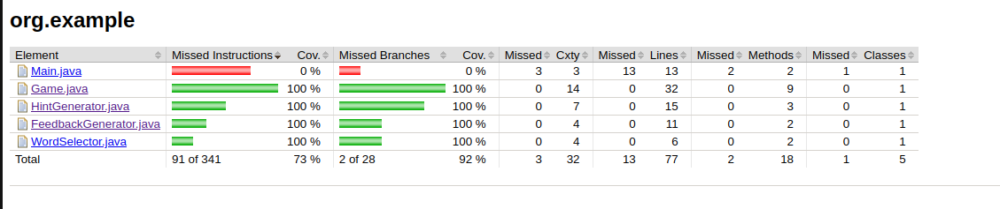

# Practica Calificada 3 - Ejercicio 3

### Descripción del juego
El videojuego será una versión de "adivina la palabra" donde el jugador debe adivinar una palabra
oculta basada en pistas dadas. Se jugará en la consola, sin interfaz gráfica. El juego proporcionará
pistas y el jugador tendrá que adivinar la palabra correcta dentro de un número limitado de intentos.

## Sprint 1: configuración básica y estructura del juego (2 puntos)

### Configuracion:
Configuración del proyecto: Crear un nuevo proyecto en Gradle y configurar dependencias para JUnit 5.
```gradle
plugins {
    id 'java'
    id 'jacoco' // Plugin de JaCoCo
}

group = 'org.example'
version = '1.0-SNAPSHOT'

repositories {
    mavenCentral()
}

dependencies {
    testImplementation platform('org.junit:junit-bom:5.10.0')
    testImplementation 'org.junit.jupiter:junit-jupiter'
    testImplementation 'org.assertj:assertj-core:3.25.3'
    testImplementation 'org.jetbrains:annotations:24.0.0'
}

test {
    useJUnitPlatform()
}

// jacoco
jacoco {
    toolVersion = "0.8.12" // Versión de JaCoCo (compatible con java 21)
}

jacocoTestReport {
    dependsOn test // Ejecuta las pruebas antes de generar el informe

    reports {
        xml.required.set(true)
        html.required.set(true)
    }
}

check.dependsOn jacocoTestCoverageVerification

// ./gradlew pitest
// ./gradlew jacocoTestReport
```

### Clases:
En este caso se creara la clase Game y se aplicara inyeccion de dependencias para sus atributos.
```java
public class Game {
    private IWordSelector wordSelector;
    private IHintGenerator hintGenerator;
    // Constructor con inyección de dependencias
    public Game(IWordSelector wordSelector, IHintGenerator hintGenerator) {
        this.wordSelector = wordSelector;
        this.hintGenerator = hintGenerator;
    }
    public void start() {
        String word = this.wordSelector.selectWord();
        String hint = this.hintGenerator.generateHint(word);
        System.out.println("Hint: " + hint);
    }
    public static void main(String[] args) {
        String[] possibleWordsList = new String[]{"example", "campeon", "maraton", "futbol"};
        int selectedWordIndex = 1;
        IWordSelector wordSelector = new WordSelector(possibleWordsList, selectedWordIndex);
        IHintGenerator hintGenerator = new HintGenerator(possibleWordsList[selectedWordIndex]);
        Game game = new Game(wordSelector, hintGenerator);
        game.start();
    }
}
```

Clase HintGenerator:

```java
public class HintGenerator implements IHintGenerator {
    String wordToGuess;

    public HintGenerator(String wordToGuess) {
        this.wordToGuess = wordToGuess;
    }

    public String generateHint(String word) {
        return "The word has " + word.length() + " letters.";
    }
}

// Interfaz IHintGenerator
public interface IHintGenerator {
    String generateHint(String word);
}
```

Clase WordSelector:

```java
public class WordSelector implements IWordSelector {
    String[] possibleWords;
    int selectedWordIndex;

    public WordSelector (String[] possibleWords, int selectedWordIndex) {
        this.possibleWords = possibleWords;
        this.selectedWordIndex = selectedWordIndex;
    }
    public String selectWord() {
        return "example";
    }
}

public interface IWordSelector {
    String selectWord();
}

```

### Refactorización y TDD: Desarrollar pruebas unitarias para cada método implementado. Refactorizar el código para mantenerlo limpio y entendible.

### TDD1

Vamos a hacer las pruebas iniciales para todas las clases:

<span style="color:red;">1. RED</span>
Aca las pruebas estan en fase roja para estas clases debido a que les falta la logica de negocio para que se puedan pasar.

Para la clase Game:


Para la clase HintGenerator:


Para la clase WordSelector:


<span style="color:green;">2. GREEN</span>

Añadiremos este codigo al constructor de Game:
```java
public class Game {
    private IWordSelector wordSelector;
    private IHintGenerator hintGenerator;
    
    // Constructor con inyección de dependencias
    public Game(IWordSelector wordSelector, IHintGenerator hintGenerator) {
        this.wordSelector = wordSelector;
        this.hintGenerator = hintGenerator;
    }
    
    public void start() {
        if (wordSelector == null || hintGenerator == null) {
            throw new IllegalArgumentException("No estan los atributos");
        }
        String word = this.wordSelector.selectWord();
        String hint = this.hintGenerator.generateHint(word);
        System.out.println("Hint: " + hint);
    }
    //... resto del codigo
}
```

En HintGenerator haremos esta modificacion:


```java
public class HintGenerator implements IHintGenerator {
    String wordToGuess;

    public HintGenerator(String wordToGuess) {
        this.wordToGuess = wordToGuess;
    }

    public String generateHint(String tryWord) {
        String hint = "";
        char[] tryWordArray = tryWord.toCharArray();
        char[] wordToGuessArray = wordToGuess.toCharArray();
        int loopLength = Math.min(tryWord.length(), wordToGuess.length());

        for (int i = 0; i < loopLength; i++) {
            if (wordToGuessArray[i] == tryWordArray[i]) {
                hint += wordToGuessArray[i];
            } else {
                hint += "_";
            }
        }
        return hint;
    }
}
```


En WordSelector haremos esta modificacion:

```java
public class WordSelector implements IWordSelector {
    String[] possibleWords;
    int selectedWordIndex;

    public WordSelector (String[] possibleWords, int selectedWordIndex) {
        this.possibleWords = possibleWords;
        this.selectedWordIndex = selectedWordIndex;
    }
    public String selectWord() {
        return this.possibleWords[this.selectedWordIndex-1];
    }
}
```


Ahora se puede ver que las pruebas pasan.


### Metricas de Codigo:

**Analisis de cobertura:**

- Para la clase Game:


- Para la clase WordSelector:


- Para la clase HintGenerator:


**Metricas**

Hallaremos el LCOM mediante el calculadorLCOM, el cual fue un programa hecho en la actividad "Metricas" del curso, el codigo estara en la carpeta "LCOMCalculator"


Como se puede ver los LCOM para las 3 clases son iguales a -1.

Esto quiere decir que el codigo en cada clase tiene alta cohesion y esto es un indicador que todo va bien.

<span style="color:blue;">3. REFACTOR</span>

Ya que las metricas estan favorables no se hara ninguna refactorizacion por el momento, en todo caso se continuara con el desarrollo en el Sprint 2.
Sin embargo se refactorizara la clase WordSelector a fin de que el codigo sea mas legible:

```java
public class WordSelector implements IWordSelector {
    private final String[] possibleWords;

    public WordSelector (String[] possibleWords) {
        this.possibleWords = possibleWords;
    }
    public String selectWord(int selectedWordIndex) {
        return this.possibleWords[selectedWordIndex-1];
    }
}
```

## Sprint 2: Lógica de juego y retroalimentación (3 puntos)

A fin de que se organize la logica del juego añadiremos este metodo a la clase HintGenerator.
```java
public class HintGenerator implements IHintGenerator {
    String wordToGuess;

    public HintGenerator(String wordToGuess) {
        this.wordToGuess = wordToGuess;
    }

    // Este es el metodo adicional
    public String generateInitialHint() {
        String hint = "";
        return hint;
    }
    
    public String generateHint(String tryWord) {
    // lo mismo...
    }
}
```

Se añadira esta clase adicional como se pide:
```java
public class FeedbackGenerator implements IFeedbackGenerator{
    private String wordToGuess;

    public FeedbackGenerator(String wordToGuess) {
        this.wordToGuess = wordToGuess;
    }

    public String generateFeedback(String tryWord) {
        return "";
    }
}
// Interfaz IFeedbackGenerator
public interface IFeedbackGenerator {
    String generateFeedback(String tryWord);
}
```

Y se añadira la logica en la clase Game:
```java
public class Game {
    private final IWordSelector wordSelector;
    private final IHintGenerator hintGenerator;
    private IFeedbackGenerator feedbackGenerator;
    private String wordToGuess;
    private int maximumAttempts;
    private int remainingAttempts;
    private boolean doYouWon;

    // Constructor con inyección de dependencias
    public Game(IWordSelector wordSelector, IHintGenerator hintGenerator, int maximumAttempts) {
        this.wordSelector = wordSelector;
        this.hintGenerator = hintGenerator;
        this.maximumAttempts = maximumAttempts;
        this.remainingAttempts = maximumAttempts;
        this.doYouWon = false;
    }
    public void start(int selectWordIndex) {
        if (wordSelector == null || hintGenerator == null) {
            throw new IllegalArgumentException("No estan los atributos");
        }
        this.wordToGuess = this.wordSelector.selectWord(selectWordIndex);
        this.feedbackGenerator = new FeedbackGenerator(wordToGuess);
        String hint = this.hintGenerator.generateInitialHint();
        System.out.println("Hint: " + hint);
    }

    public void tryToGuessLetter(String tryString) {
        System.out.println("Tu intento: " + tryString);
    }

    public boolean getDoYouWon(){
        return this.doYouWon;
    }

    public void setDoYouWon(boolean doYouWon) {
        this.doYouWon = doYouWon;
    }

    public void setIntents(int newIntents) {
        this.remainingAttempts = newIntents;
    }

    public int getRemainingAttempts(){
        return this.remainingAttempts;
    }

    public int getMaximumAttempts() {
        return this.maximumAttempts;
    }

    public String getWordToGuess(){
        return this.wordToGuess;
    }

    public String winningAdvice(){
        return doYouWon ? "You win bro, congrats" : "You lose. Correct word is: " + this.wordToGuess;
    }
}
```

## TDD-2

<span style="color:red;">1. RED</span>

Aqui se ve que las pruebas estan en rojo, en la clase Game:


Para la clase WordSelector:


Para la clase HintGenerator:


Asi que tendremos que completar la logica en estas clases para que las pruebas pasen.

<span style="color:blue;">2. GREEN</span>

Completamos este codigo en la clase Game:

```java
public class Game{
    //...resto del codigo

    public void tryToGuessLetter(String tryString) {
        System.out.println("Tu intento: " + tryString);
        setIntents(remainingAttempts-1);
        if (remainingAttempts<0) {
            throw new RuntimeException(winningAdvice());
        }
        if (this.wordToGuess.equals(tryString)) {
            setDoYouWon(true);
        } else {
            System.out.println("Feedback: " + feedbackGenerator.generateFeedback(tryString));
            String hint = this.hintGenerator.generateHint(tryString);
            System.out.println("Hint: " + hint);
        }
    }
    
    //...resto del codigo
}
```


En la clase WordSelector:

```java
public class WordSelector implements IWordSelector {
    private final String[] possibleWords;

    public WordSelector (String[] possibleWords) {
        this.possibleWords = possibleWords;
    }
    public String selectWord(int selectedWordIndex) {
        if (selectedWordIndex <= 0 || selectedWordIndex > possibleWords.length) {
            throw new IllegalArgumentException("");
        }
        return this.possibleWords[selectedWordIndex-1];
    }
}
```


En la clase HintGenerator:

```java
public class HintGenerator implements IHintGenerator {
    String wordToGuess;

    public HintGenerator(String wordToGuess) {
        this.wordToGuess = wordToGuess;
    }

    public String generateInitialHint() {
        String hint = "";
        for (int i = 0; i < wordToGuess.length(); i++) {
            hint += "_";
        }
        return hint;
    }
    //...resto del codigo
}
```


Una vez puesta la logica se ve que las pruebas pasan

### Metricas de Codigo:

**Analisis de cobertura:**

- Para la clases del programa:



**Metricas**

- **LCOM4**

Se ve mediante el editor que todas las clases estan en azul y esto si bien es porque las clases se usan en el testing tambien es porque estan contenidos con otras componentes, sin embargo el metodo *getMaximumAttempts()* no es asi.

Por lo que el LCOM4 = 2 debido a *getMaximumAttempts()* 


En HintGenerator el LCOM4 = 2 debido a que *generateInitialHint()* no tiene mucha conexion con *generateHint()*.

En WordSelector y FeedbackGenerator el LCOM4 = 1

- **CAMC**

*CAMC = [sumatorio de tipos de parámetros únicos utilizados por todos los métodos] /[número total de métodos× número máximo de parámetros por método.]*

Para la clase Game:

Los metodos son: start(selectWordIndex), tryToGuessLetter(String tryString), getDoYouWon(), setDoYouWon(boolean doYouWon), setIntents(int newIntents), getRemainingAttempts(), getMaximumAttempts(), getWordToGuess(), winningAdvice()

CAMC = 4/9*1 = 0.44

Para la clase WordSelector:

selectWord(selectedWordIndex)

CAMC = 1/1*1 = 1

Para la clase HintGenerator:

generateInitialHint(), generateHint(String tryWord)

CAMC = 1/2*1 = 0.5

Esto quiere decir que hay que refactorizar las clases HintGenerator y Game.

**Analisis de cobertura:**

- Para todas las clases:


<span style="color:blue;">3. REFACTOR</span>

En la clase Game le quitamos el metodo *getMaximumAttempts()*:

```java
// Clase Game modificada
public class Game {
    private final IWordSelector wordSelector;
    private final IHintGenerator hintGenerator;
    private IFeedbackGenerator feedbackGenerator;
    private String wordToGuess;
    private int maximumAttempts;
    private int remainingAttempts;
    private boolean doYouWon;

    // Constructor con inyección de dependencias
    public Game(IWordSelector wordSelector, IHintGenerator hintGenerator, int maximumAttempts) {
        this.wordSelector = wordSelector;
        this.hintGenerator = hintGenerator;
        this.maximumAttempts = maximumAttempts;
        this.remainingAttempts = maximumAttempts;
        this.doYouWon = false;
    }
    public void start(int selectWordIndex) {
        if (wordSelector == null || hintGenerator == null) {
            throw new IllegalArgumentException("No estan los atributos");
        }
        this.wordToGuess = this.wordSelector.selectWord(selectWordIndex);
        System.out.println("Tienes un maximo de: " + this.maximumAttempts);
        this.feedbackGenerator = new FeedbackGenerator(wordToGuess);
        String hint = this.hintGenerator.generateInitialHint();
        System.out.println("Hint: " + hint);

    }

    public void tryToGuessLetter(String tryString) {
        System.out.println("Tu intento: " + tryString);
        setIntents(remainingAttempts-1);
        if (remainingAttempts<0) {
            throw new RuntimeException(winningAdvice());
        }
        if (this.wordToGuess.equals(tryString)) {
            setDoYouWon(true);
        } else {
            System.out.println("Feedback: " + feedbackGenerator.generateFeedback(tryString));
            String hint = this.hintGenerator.generateHint(tryString);
            System.out.println("Hint: " + hint);
        }
    }

    public boolean getDoYouWon(){
        return this.doYouWon;
    }

    public void setDoYouWon(boolean doYouWon) {
        this.doYouWon = doYouWon;
    }

    public void setIntents(int newIntents) {
        this.remainingAttempts = newIntents;
    }

    public int getRemainingAttempts(){
        return this.remainingAttempts;
    }

    public String getWordToGuess(){
        return this.wordToGuess;
    }

    public String winningAdvice(){
        return doYouWon ? "You win bro, congrats" : "You lose. Correct word is: " + this.wordToGuess;
    }
}
```

En HintGenerator eliminamos generateInitialHint(), en todo caso si queremos hacer la misma funcionalidad seria generateHint("");

```java
public class HintGenerator implements IHintGenerator {
    String wordToGuess;

    public HintGenerator(String wordToGuess) {
        this.wordToGuess = wordToGuess;
    }

    public String generateHint(String tryWord) {
        String hint = "";
        char[] tryWordArray = tryWord.toCharArray();
        char[] wordToGuessArray = wordToGuess.toCharArray();
        for (int i = 0; i < wordToGuess.length(); i++) {
            if (i >= tryWord.length() || wordToGuessArray[i] != tryWordArray[i]) {
                hint += "_";
            } else {
                hint += wordToGuessArray[i];
            }
        }

        return hint;
    }
}
```

## Sprint 3: Refinamiento y finalización (4 puntos)


## TDD-3

<span style="color:red;">1. RED</span>

Aqui se ve que las pruebas estan en rojo, en la clase Game:


Esto debido a que no se quiere que usen las dependencias IHintGenerator ni IFeedbackGenerator, sino en reemplazo un contenedor de inyeccion de dependencias

```java
// Clase Game modificada
public class Game {
    private final IWordSelector wordSelector;
    private IHintGenerator hintGenerator;
    private IFeedbackGenerator feedbackGenerator;
    private String wordToGuess;
    private final int maximumAttempts;
    private int remainingAttempts;
    private boolean doYouWon;

    // Constructor donde ya no se depende de IHintGenerator ni IFeedbackGenerator
    public Game(String[] possibleWords, int maximumAttempts) {
        this.wordSelector = null;
        this.maximumAttempts = maximumAttempts;
        this.remainingAttempts = maximumAttempts;
        this.doYouWon = false;
    }
    // etc
}
```

<span style="color:green;">2.y 3. GREEN y REFACTOR</span>

Desde el Sprint1 se implemento la inyección de dependencias para las clases WordSelector y HintGenerator. (Ejercicio 1)

Lo que corresponde es implementar un contenedor de inyección de dependencias simple para gestionar las dependencias del juego. (Ejercicio 2)
- Crearemos la clase DependencyInjector que servira para gestionar las dependencias.

```java
public class DependencyInjector {
    public static IHintGenerator hintGenerator(String wordToGuess) {
        return new HintGenerator(wordToGuess);
    }
    public static IWordSelector wordSelector(String[] possibleWords) {
        return new WordSelector(possibleWords);
    }
}
```
- Se modificara clase Game para obtener las dependencias a través del contenedor mediante *start()*

```java
// Clase Game modificada
public class Game {
    private final IWordSelector wordSelector;
    private IHintGenerator hintGenerator;
    private IFeedbackGenerator feedbackGenerator;
    private String wordToGuess;
    private final int maximumAttempts;
    private int remainingAttempts;
    private boolean doYouWon;

    // Constructor con inyección de dependencias
    public Game(String[] possibleWords, int maximumAttempts) {
        this.wordSelector = DependencyInjector.wordSelector(possibleWords);
        this.maximumAttempts = maximumAttempts;
        this.remainingAttempts = maximumAttempts;
        this.doYouWon = false;
    }
    public void start(int selectWordIndex) {
        if (wordSelector == null || hintGenerator == null) {
            throw new IllegalArgumentException("No estan los atributos");
        }
        this.wordToGuess = this.wordSelector.selectWord(selectWordIndex);
        this.hintGenerator = DependencyInjector.hintGenerator(wordToGuess);
        System.out.println("Tienes un maximo de: " + this.maximumAttempts + " intentos");
        this.feedbackGenerator = new FeedbackGenerator(wordToGuess);
        String hint = this.hintGenerator.generateHint("");
        System.out.println("Hint: " + hint);

    }
}
```


### Metricas de Codigo:

**Analisis de cobertura:**

- Se puede ver que luego de nuestra refactorizacion la complejidad ciclomatica de la clase Game tiene numero 13 y esto indica que se necesita refactorizar mas, ademas que se reducio de 14 a 13 respecto al Sprint2. Las otras clases estan en un rango inferior a 10 por lo que estan en el rango ideal.


3. Aplica principios SOLID al código del juego: (Ejercicio 3)

**Principio de responsabilidad única (SRP):** 
Esta aplicado debido a que la lógica de selección de palabras y generación de pistas en clases separadas, siendo estas WordSelector y HintGenerator respectivamente.

**Principio de abierto/cerrado (OCP):** 
Al añadirle a la clase Game un atributo de la clase HintGenerator, esto hace que Game ahora este abierto para la extensión y cerrado para la modificación, ya que podemos cambiar la implementación de HintGenerator sin modificar Game.

**Adicional:**

Funcionalidad para obtener la nueva pista luego de un numero de intentos fallidos.
```java
// Clase Game modificada
public class Game {
    // Para obtener la nueva pista luego de un numero de intentos fallidos
    public void tryToGuessLetter(String tryString) {
        if (remainingAttempts==1) {
            System.out.println(this.hintGenerator.getSpecialHint());
        }
        // etc...
    }
}
```


